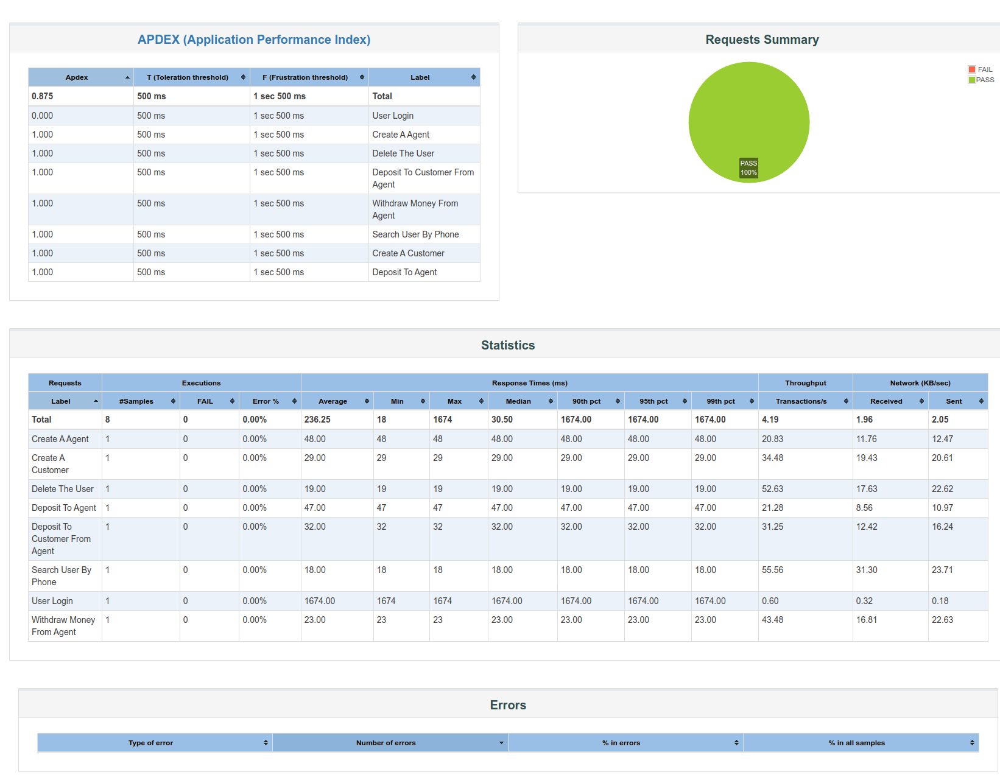
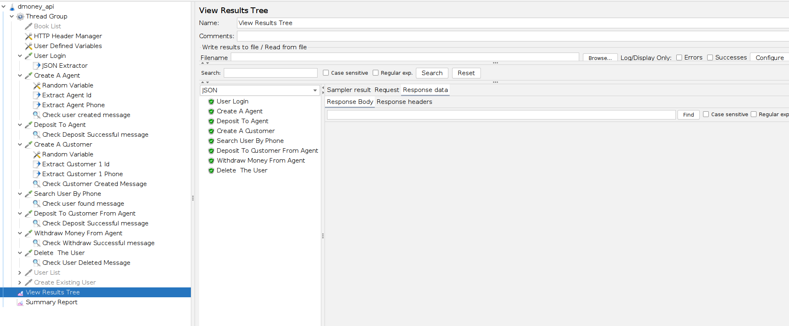
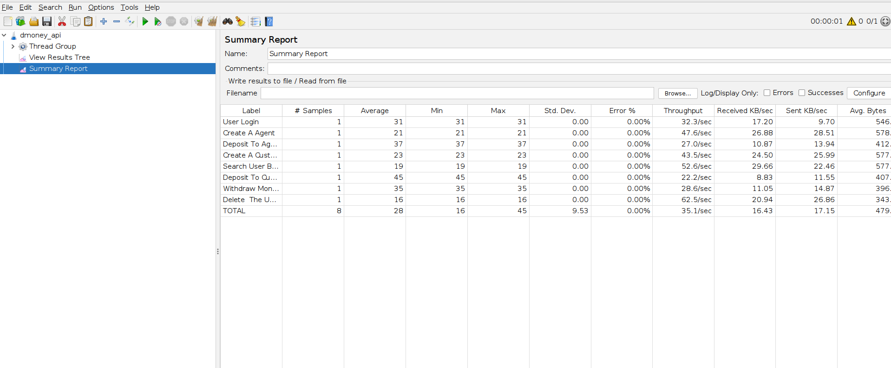

# dmoney api jmx

This is a Jmeter project, where dmoney api is used for api test.

---
### API Documentation
- [Dmoney API Test](https://documenter.getpostman.com/view/12316264/2s8ZDeUKKL)


### Requests
- Login to user
- Create a new agent
- Deposit to agent
- Create a customer
- Search customer by phone number
- Deposit to customer
- Withdraw money
- Delete user


### Prerequisites
- Jmeter
- postman

### How to run the project
1. Clone the repo
2. Open cmd in the root folder
3. Give the following commands

```
jmeter -n -t dmoney_api.jmx -l dmoney.jtl -e -o dmoneyReports
```


### Generated reports


- **Jmeter Project Structure**


- **Jmeter Summary Report**



---
|:warning: **Dont change anything in **Thread properties** in jmeter.**|
| --- |
